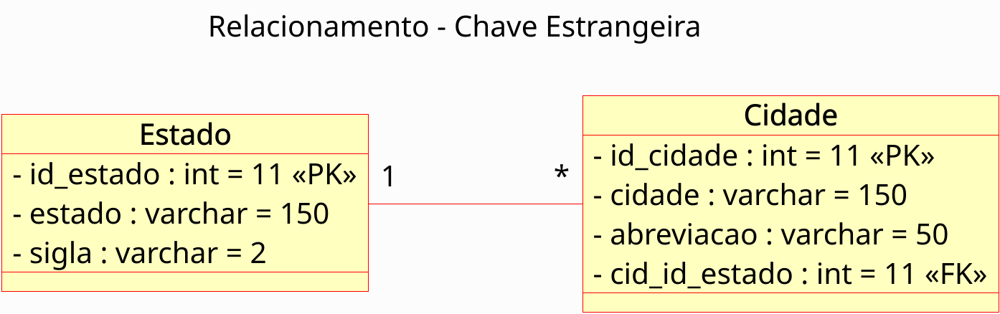

# Relacionamento 1:N com Chave Estrangeira - Estado e Cidade

Este repositório apresenta um exercício prático de modelagem de banco de dados com foco em **relacionamentos entre entidades**. O objetivo é implementar um **relacionamento 1:N (um-para-muitos)** entre os conceitos de `Estado` e `Cidade`, utilizando **chave estrangeira** conforme ilustrado no diagrama de classes.

## 🧩 Diagrama de Classes



## 🧠 Descrição

O script SQL presente neste repositório cria duas tabelas:
- `Estado`: contém identificador, nome e sigla do estado.
- `Cidade`: contém identificador, nome, abreviação e uma chave estrangeira que referencia `Estado`.

Foram incluídos dados reais de estados e cidades da região Norte do Brasil. As abreviações de cidades seguem o padrão de códigos **IATA**.

## 📄 Script SQL

O script está disponível em [`sql/estado_cidade.sql`](sql/estado_cidade.sql).

Trecho de exemplo:

```sql
CREATE TABLE Estado (
    id_estado INT(11) PRIMARY KEY,
    estado VARCHAR(150) NOT NULL,
    sigla VARCHAR(2) NOT NULL
);

CREATE TABLE Cidade (
    id_cidade INT(11) PRIMARY KEY,
    cidade VARCHAR(150) NOT NULL,
    abreviacao VARCHAR(50),
    cid_id_estado INT(11) NOT NULL,
    FOREIGN KEY (cid_id_estado) REFERENCES Estado(id_estado)
);